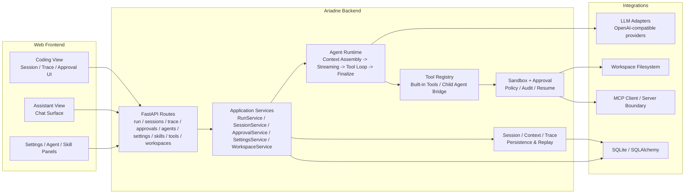

# Ariadne

<p align="center">
  
</p>

<p align="center">
  统一 AI 工作台后端，支持流式对话、工具调用、权限审批、运行追踪与多 Agent 协作。
</p>

<p align="center">
  <a href="https://github.com/WanGXUUvU/ariadne">GitHub</a>
</p>

## 项目简介

Ariadne 是一个统一 AI 工作台，目标是在同一产品内承载对话式工作流与开发者工作流，并提供稳定的运行时、工具调用和状态管理能力。

## 系统架构



架构要点：

- 当前前端只有 Web 入口，包含 `Coding View`、`Assistant View` 以及设置、Agent、Skill 等管理面板。
- `FastAPI Routes` 暴露运行、会话、Trace、审批、Agent、技能、工具、工作区与设置接口，承接前端全部交互。
- `Application Services` 负责编排运行生命周期、会话管理、审批恢复、模型配置与工作区管理，不直接承载底层工具细节。
- `Agent Runtime` 将一次运行拆分为上下文装配、流式输出、工具循环、结果回填和最终收口，降低主链路耦合。
- `Tool Registry + Sandbox + Approval` 统一处理工具注册、执行边界、风险分级、人工审批与恢复执行。
- `Session / Context / Trace` 持久化运行事件、会话状态与回放数据，为多轮协作和问题追踪提供基础。

## 核心特性

- 流式对话与结构化事件输出
- 工具注册、白名单控制与权限审批
- 会话状态、上下文与运行轨迹持久化
- 技能扩展与多 Agent 协作
- 面向工作区场景的沙箱隔离能力

## 技术栈

- 后端：Python、FastAPI、SQLAlchemy、SQLite
- 前端：Vue 3、TypeScript、Vite
- 运行时：SSE Streaming、工具中间件、会话持久化、审批流程

## 仓库结构

```text
backend/   FastAPI API、Runtime、Tools、Security、Memory、MCP
frontend/  基于 Vue 3 + Vite 的 Web Workspace
docs/      项目文档与架构资源
specs/     历史任务记录
```

## 快速开始

### 后端

```bash
python3 -m compileall backend/
python3 -m unittest discover -s backend/tests -p 'test_*.py' -v
cd backend && python3 -m api.app
```

### 前端

```bash
cd frontend
npm install
npm run dev
```
