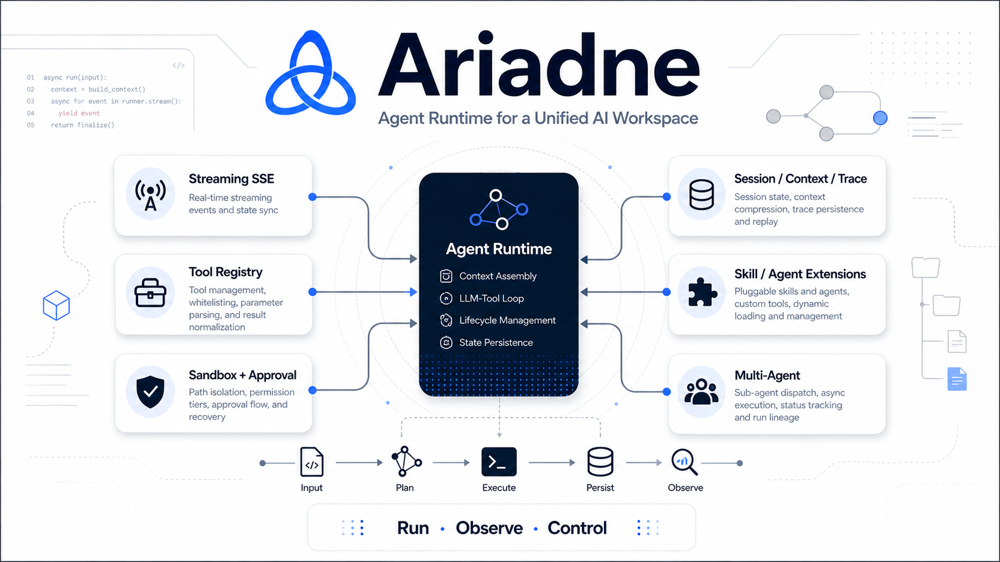

# Ariadne

<p align="center">
  
</p>

<p align="center">
  统一 AI 工作台运行时，覆盖流式对话、工具执行、权限审批、运行追踪与多 Agent 协作。
</p>

<p align="center">
  <a href="https://github.com/WanGXUUvU/ariadne">GitHub</a>
</p>

## 项目简介

Ariadne 是一个统一 AI 工作台，目标是在同一产品内承载对话式工作流与开发者工作流。

当前重点能力：

- 分层 `Agent Runtime`
- 基于 `SSE` 的流式输出与结构化事件流
- `Tool Registry`、沙箱隔离与审批恢复
- `Session / Context / Trace` 持久化
- `Skill / Agent` 扩展
- `Multi-Agent` 调度与运行链路追踪

## 核心能力

### Agent Runtime

- 运行时按 `RunService`、`RunContextFactory`、`AgentRunner`、`RunLifecycle`、`RunRecorder` 分层拆分
- 覆盖上下文装配、模型与工具循环、运行收口和状态持久化
- 提供 run 级 `VFS`，支持文件改动提交 / 回滚语义

### 工具执行

- 统一 `Tool Registry`，支持白名单校验、参数解析、结果标准化和风险分级
- 内置文件系统、搜索、基础工具和 Agent Bridge 工具
- 提供带审批能力的异步工具执行链路

### 状态与追踪

- 支持会话状态持久化与历史消息恢复
- 支持上下文压缩与可回放的运行轨迹
- 支持父子 Run 关联与多 Agent 运行追踪

### 安全与控制

- 统一处理沙箱路径重写与工作区隔离
- 支持权限档位与审批策略配置
- 支持高风险工具调用的暂停 / 恢复流程

## 技术栈

- 后端：Python、FastAPI、SQLAlchemy、SQLite
- 前端：Vue 3、TypeScript、Vite
- 运行时：SSE Streaming、工具中间件、会话持久化、审批流程

## 仓库结构

```text
backend/   FastAPI API、Runtime、Tools、Security、Memory、MCP
frontend/  基于 Vue 3 + Vite 的 Web Workspace
docs/      项目文档、数据结构说明与架构资源
specs/     任务卡与历史实现记录
```

## 快速开始

### 后端

```bash
python3 -m compileall backend/
python3 -m unittest discover -s backend/tests -p 'test_*.py' -v
cd backend && python3 -m api.app
```

### 前端

```bash
cd frontend
npm install
npm run dev
```
