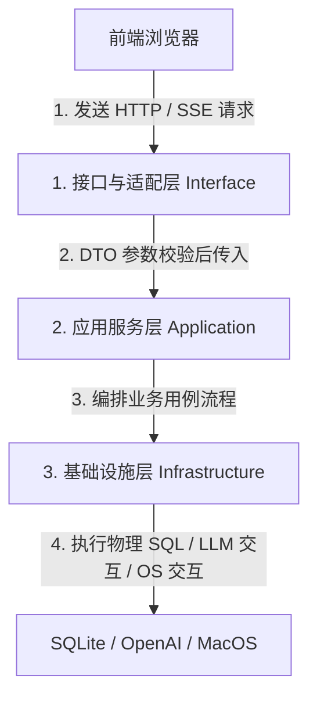
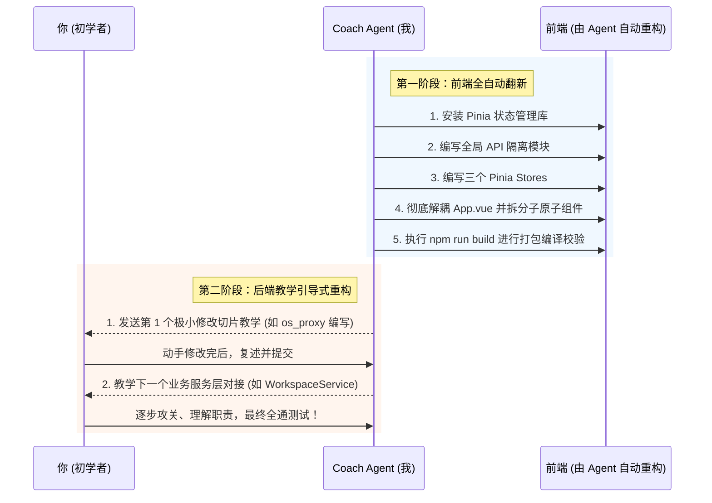

# 🏗️ 工业级 Agent 架构双轨改造设计方案 (ARCHITECTURE_REFACTORING.md)

本改造方案是针对您当前项目下所有后端 Python 文件及 Vue 3 前端项目的重构设计白皮书。为完美契合您的学习与开发规划，本方案采用 **“双轨并行重构策略”**：

*   **后端：教学驱动轨道 (Coach-Led Track)**：精简不必要的 DDD 样板代码，采用 **实用主义三层架构**，设计成极易上手的低心智负担模型，由 Coach Agent **带领您小步快跑，一步步引导、教学并由您动手改动**。
*   **前端：自动重构轨道 (Agent-Driven Auto Refactoring)**：由 Agent **直接按照白皮书设计的蓝图进行全自动重构**，引入 Pinia 状态管理，彻底粉碎 9KB 的巨无霸单体文件 `App.vue`，实现极致的高内聚组件解耦。

---

## 🧭 一、 后端“实用主义三层架构”重构蓝图 (后端新手教学轨道)

为了帮您轻松跨越后端开发的初级阶段，我们摒弃了过于臃肿的绝对 DDD 映射（不再强制分离 Domain Entity 与 DB PO Model，不自研 DI 容器），转而使用 FastAPI 社区最标准、最实用的 **“API 控制器 -> App 业务服务 -> DB 基础设施”** 三层模型。

### 1. 职责边界大检阅（每层只做一件事）



#### 🟢 接口层 (Interface Layer) - 协议转换与网关
*   **负责什么**：FastAPI 路由映射（`/routes`）、HTTP 请求参数强校验（Pydantic DTO）、标准化 API JSON 响应序列化。
*   **不负责什么**：绝不写任何业务逻辑，不执行数据库 SQL。
*   **输入**：网络 HTTP Request。
*   **输出**：网络 HTTP Response (JSON / SSE Stream)。
*   **下一层流向**：直接调用 **应用服务层 (Application Service)**。

#### 🟡 应用服务层 (Application Layer) - 业务用例编排
*   **负责什么**：编排具体业务流程（Use Cases）。例如：“创建一个 Session -> 绑定物理工作区 -> 记录审计日志” 这串连贯逻辑。
*   **不负责什么**：不理会 HTTP 细节，不直接编写底层物理 SQL。
*   **输入**：纯 Python 对象 / 基础入参类型。
*   **输出**：业务计算结果或状态对象。
*   **上一层来源**：接口层。
*   **下一层流向**：调用 **基础设施层 (Infrastructure)**。

#### 🔴 基础设施层 (Infrastructure Layer) - 底层驱动与持久化
*   **负责什么**：数据库模型（SQLAlchemy Models）、物理 CRUD 操作（数据库 Helper）、大模型 API 请求（LLM Adapter）、物理工具集（Tools API）以及物理操作系统代理（如拉起 macOS 原生 Finder 选择框）。
*   **不负责什么**：不制定核心业务逻辑，不负责接口控制。
*   **输入**：物理方法入参。
*   **输出**：物理层真实执行数据（如 DB 记录、OS 返回路径）。

---

### 2. 重构后极简的后端文件物理树

```text
backend/
├── interface/                                  # 🌟 控制层：提供 API 暴露与入参校验
│   ├── __init__.py
│   ├── api/
│   │   ├── __init__.py
│   │   ├── app.py                              # [MOVE] 负责全局中间件挂载与总路由初始化
│   │   └── routes/                             # [MOVE] 原 api/routes/ 控制器整体迁移至此
│   │       ├── __init__.py
│   │       ├── session_routes.py
│   │       ├── run_routes.py
│   │       └── workspace_routes.py             # [NEW] 触发 Finder 弹窗与绑定
│   └── dto/
│       ├── __init__.py
│       └── schemas.py                          # 专职 API DTO 参数结构定义
│
├── application/                                # 🌟 业务层：用例编排与运行时引擎
│   ├── __init__.py
│   ├── services/
│   │   ├── __init__.py
│   │   ├── session_service.py                  # [REFACTOR] 会话核心用例
│   │   ├── workspace_service.py                # [NEW] 本地物理文件夹绑定逻辑
│   │   └── run_service.py                      # [MIGRATED] 原执行编排服务
│   └── runtime/
│       ├── __init__.py
│       ├── agent_runtime.py                    # 运行时引擎 (剥离底层 DB 直接引用)
│       └── tool_pipeline.py                    # [精髓] 管道拦截器模式 (拦截沙箱越界、审计与审批)
│
└── infrastructure/                             # 🌟 物理层：持久化、大模型与 OS 代理
    ├── __init__.py
    ├── database/
    │   ├── __init__.py
    │   ├── db.py                               # 数据库 Session 连接池
    │   └── models.py                           # 数据库贫血表映射（各层共享）
    ├── llm/
    │   ├── __init__.py
    │   └── adapter.py                          # 大模型收发适配
    ├── os_proxy/
    │   ├── __init__.py
    │   └── apple_script.py                     # [NEW] MacOS osascript Finder 物理选择对话框代理
    └── tools/
        ├── __init__.py
        ├── tool_registry.py                    # 工具收集与物理注册中心
        └── builtin/                            # 物理内置工具具体实现 (fs_read, fs_write 等)
```

---

### 3. 后端精髓解耦设计：工具执行拦截器管道 (Tool Interceptor Pipeline)

后端改造中，唯一的纯硬核解耦点在于 **工具管道化模式**。
大模型在调用工具（如读写文件）时，我们需要**拦截沙箱越界**、**拦截危险操作审批**。将这些独立职责做成“洋葱圈中间件”，可以避免主 Runtime 引擎堆积大量 `if-else`。

📄 **管道核心逻辑文件**：`backend/application/runtime/tool_pipeline.py`

```python
from abc import ABC, abstractmethod
from typing import Any, Dict, Callable

class IToolInterceptor(ABC):
    """
    拦截器基类。
    职责：定义拦截器标准，所有安全校验、审批流、调用统计均实现此接口。
    """
    @abstractmethod
    async def intercept(
        self, 
        tool_name: str, 
        arguments: Dict[str, Any], 
        context: Dict[str, Any], 
        next_call: Callable
    ) -> Any:
        pass

class SandboxPathInterceptor(IToolInterceptor):
    """
    1. 物理沙箱路径越界拦截器。
    职责：检查入参中是否包含路径。若包含路径，强制进行 '..' 与软链接物理校验，越界直接抛出 PermissionError！
    """
    def __init__(self, workspace_root: str):
        self.workspace_root = workspace_root

    async def intercept(self, tool_name: str, arguments: Dict[str, Any], context: Dict[str, Any], next_call: Callable) -> Any:
        # 教练模式会带领你在此处实现严格的 os.path.realpath 校验逻辑
        print("【安全层】启动沙箱校验...")
        return await next_call(tool_name, arguments, context)

class ApprovalGateInterceptor(IToolInterceptor):
    """
    2. 危险操作用户审批门禁。
    职责：根据工具安全策略，决定是否暂停执行、向前端广播“等待审批”。
    """
    async def intercept(self, tool_name: str, arguments: Dict[str, Any], context: Dict[str, Any], next_call: Callable) -> Any:
        print("【审批层】启动权限门禁...")
        return await next_call(tool_name, arguments, context)
```

> [!NOTE]
> **后端改造的教学承诺**：
> 在接下来的实现阶段，Coach Agent **绝对不会擅自修改您的 Python 代码**。Coach 将会以极具耐心的步骤，引导你从 `infrastructure/os_proxy` 开始，由浅入深，边写边学，彻底搞懂每一个参数和职责边界。

---

## 🪐 二、 前端“现代状态化组件”重构蓝图 (Agent 全自动重构轨道)

目前前端代码中，`App.vue` 作为一个 9KB 的巨无霸单体文件，承担了全站的逻辑。为了使前端能够稳健支撑“多 Agent 协作”、“文件 Diff 审计”、“工具卡片手风琴展示”等复杂特性，Agent 将按照以下设计，**为您进行全自动、一键式前端翻新改造**。

### 1. 前端物理文件目录结构设计

Agent 将把单体 `App.vue` 拆解为高度解耦、职责单一的原子化文件目录：

```text
frontend/src/
├── main.ts                    # 入口文件：注入 Pinia 状态管理器与全局样式
├── App.vue                    # 清洁的主入口：仅负责挂载主 AppLayout 组件
├── assets/                    # 静态资源与字体文件
├── styles/
│   └── variables.css          # 全局 HSL 主题配色系统与磨砂拟态定义
├── api/
│   ├── client.ts              # 统一封装 fetch 请求及 SSE (Server-Sent Events) 打字机流读取
│   ├── session.ts             # 会话相关 API (创建、重命名、删除、历史回放)
│   └── workspace.ts           # 物理工作区绑定 API (拉起 MacOS 弹窗接口)
├── stores/
│   ├── session.ts             # Pinia Store: 会话及工作区分组全局状态
│   └── run.ts                 # Pinia Store: 消息流渲染、实时 Trace 执行状态
└── components/
    ├── layout/
    │   ├── AppLayout.vue      # 顶层网格布局控制
    │   └── AppHeader.vue      # 极客变色毛玻璃 Header 头部
    ├── chat/
    │   ├── ChatWindow.vue     # 对话渲染流核心视窗
    │   ├── ChatMessage.vue    # 820px 黄金视幅气泡 (支持 Markdown 与代码高亮)
    │   └── ChatInput.vue      # 3D 聚焦悬浮拟态输入栏
    ├── trace/
    │   ├── TracePanel.vue     # 右侧实时 Trace 监听面板
    │   └── TraceAccordion.vue # 精美 SVG 镂空图标手风琴工具执行卡片
    └── workspace/
        └── WorkspaceSelector.vue # 工作区绑定引导挂载器
```

---

### 2. 前端核心重构代码范本与规范

为确保 Agent 自动修改时的绝对高品质与无 Bug 打包，以下给出核心模块的落地细节：

#### A. 状态中心化：引入 Pinia Store 管理状态

彻底解决多组件 Props/Emit 混乱传递的噩梦。

📄 **文件位置**：`frontend/src/stores/session.ts`
```typescript
import { defineStore } from 'pinia'
import { ref, computed } from 'vue'
import { sessionApi } from '../api/session'
import { workspaceApi } from '../api/workspace'

export interface Session {
  session_id: string
  session_name: string
  workspace_path: string | null
  workspace_name: string | null
  message_count: number
}

export const useSessionStore = defineStore('session', () => {
  const sessions = ref<Session[]>([])
  const activeSessionId = ref<string>('')
  const loading = ref(false)

  // 核心计算属性：将 Sessions 列表按绑定的物理路径智能分组（用于手风琴折叠显示）
  const groupedSessions = computed(() => {
    const groups: Record<string, { name: string; sessions: Session[] }> = {}
    const UNBOUND_KEY = 'UNBOUND'
    
    groups[UNBOUND_KEY] = {
      name: '💬 独立个人会话',
      sessions: []
    }

    sessions.value.forEach(s => {
      if (s.workspace_path) {
        if (!groups[s.workspace_path]) {
          groups[s.workspace_path] = {
            name: `📁 ${s.workspace_name}`,
            sessions: []
          }
        }
        groups[s.workspace_path].sessions.push(s)
      } else {
        groups[UNBOUND_KEY].sessions.push(s)
      }
    })

    if (groups[UNBOUND_KEY].sessions.length === 0) {
      delete groups[UNBOUND_KEY]
    }

    return groups
  })

  // 绑定物理工作区
  async function bindWorkspace() {
    loading.value = true
    try {
      const path = await workspaceApi.triggerSelectDialog()
      if (path) {
        // 创建绑定了该工作区的全新会话
        const newSession = await sessionApi.create({ workspace_path: path })
        sessions.value.unshift(newSession)
        activeSessionId.value = newSession.session_id
      }
    } finally {
      loading.value = false
    }
  }

  return {
    sessions,
    activeSessionId,
    loading,
    groupedSessions,
    bindWorkspace
  }
})
```

#### B. 核心组件解耦：超高颜值手风琴侧边栏

设计优雅流畅的高度过渡 CSS 动效（借助 CSS Grid 实现纯样式流畅高度折叠，不挂载任何外部 JS 动画库，确保极佳的流畅度）。

📄 **文件位置**：`frontend/src/components/layout/SessionSidebar.vue`
```vue
<template>
  <aside class="sidebar-container">
    <div class="workspace-header">
      <h3 class="title">📂 物理工作区</h3>
      <button class="btn-select-dialog" @click="store.bindWorkspace" :disabled="store.loading">
        <span class="icon">{{ store.loading ? '⏳' : '➕' }}</span>
        <span>添加本地文件夹</span>
      </button>
    </div>

    <!-- 滚动容器 -->
    <div class="accordion-wrapper">
      <div 
        v-for="(group, path) in store.groupedSessions" 
        :key="path" 
        class="accordion-group"
        :class="{ 'is-expanded': expandedGroups[path] }"
      >
        <!-- 分组 Header -->
        <div class="group-title-bar" @click="toggleGroup(path)">
          <span class="chevron">▶</span>
          <span class="group-name" :title="path">{{ group.name }}</span>
          <span class="badge">{{ group.sessions.length }}</span>
        </div>

        <!-- CSS Grid 魔法实现的流畅折叠盒子 -->
        <div class="group-content-box">
          <div class="group-content-inner">
            <div 
              v-for="session in group.sessions" 
              :key="session.session_id" 
              class="session-card"
              :class="{ 'is-active': session.session_id === store.activeSessionId }"
              @click="store.activeSessionId = session.session_id"
            >
              <div class="session-info">
                <span class="session-icon">💬</span>
                <span class="session-name">{{ session.session_name }}</span>
              </div>
              <span class="msg-count">{{ session.message_count }}</span>
            </div>
          </div>
        </div>
      </div>
    </div>
  </aside>
</template>

<script setup lang="ts">
import { ref } from 'vue'
import { useSessionStore } from '../../stores/session'

const store = useSessionStore()
const expandedGroups = ref<Record<string, boolean>>({})

function toggleGroup(path: string) {
  expandedGroups.value[path] = !expandedGroups.value[path]
}
</script>

<style scoped>
.sidebar-container {
  width: 300px;
  background: rgba(18, 18, 24, 0.8);
  backdrop-filter: blur(20px);
  border-right: 1px solid rgba(255, 255, 255, 0.08);
  height: 100vh;
  display: flex;
  flex-direction: column;
}

/* 利用 Grid-template-rows 实现完美纯 CSS 优雅高度折叠 */
.group-content-box {
  display: grid;
  grid-template-rows: 0fr;
  transition: grid-template-rows 0.3s cubic-bezier(0.4, 0, 0.2, 1);
}

.accordion-group.is-expanded .group-content-box {
  grid-template-rows: 1fr;
}

.group-content-inner {
  overflow: hidden;
}

.chevron {
  transition: transform 0.3s ease;
  display: inline-block;
}

.accordion-group.is-expanded .chevron {
  transform: rotate(90deg);
}

/* 渐变磨砂按钮 */
.btn-select-dialog {
  background: linear-gradient(135deg, hsl(260, 80%, 65%), hsl(290, 85%, 60%));
  border: none;
  border-radius: 8px;
  color: white;
  padding: 10px;
  cursor: pointer;
  box-shadow: 0 4px 15px rgba(139, 92, 246, 0.3);
  transition: transform 0.2s, box-shadow 0.2s;
}

.btn-select-dialog:hover {
  transform: translateY(-1px);
  box-shadow: 0 6px 20px rgba(139, 92, 246, 0.5);
}
</style>
```

---

## 📈 三、 双轨改造实施路线图 (Action Checklist)

为确保工程落地安全，整个改造过程将划分成以下小步：



---

> [!TIP]
> **双轨方案优势**：
> 1. 前端复杂的模块拆解、样式优化与 Pinia 依赖搭建由 Agent 全代劳，帮您**节省 90% 繁琐机械的前端排雷时间**，直接获得精美、解耦的前端工作台。
> 2. 后端核心架构剥离了学院派过度设计，保留核心分层骨架。Coach Agent 每次只给出**几行到十几行的极小改造指令与深刻中文注释**，作为您的“私人教练”，帮您真正吃透后端架构的设计哲学！
