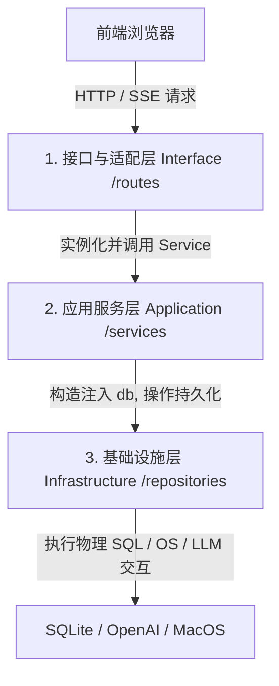

# TASK-073 - 工业级 Agent 架构双轨改造与极致 OOP 重构 (全面整编版)

## 1. 核心目标 (Core Goal)
遵循我们的双轨开发模式（前端自动，后端教学），将后端所有业务服务层（`application/services/`）及关联层级（接口路由、仓储、运行时）进行**工业级 OOP 重构与命名规范统一**。
*   **极致 OOP 类重编**：彻底废除服务层函数传参携带 `db: Session` 的拖泥带水设计，改为在构造方法 `__init__(self, db: Session)` 中注入依赖。
*   **命名规范大一统**：消除所有非标命名（如 `setting_services.py` 纠正为 `settings_service.py`），使服务类、文件和接口控制器保持一致的专业水准。

---

## 2. 极致规范分层与职责边界 (Layer Boundaries)

在工业级架构中，各层必须保持单一职责（SRP）与高内聚：

### 2.1 接口与路由层 (Interface Layer /routes)
*   **负责**：解析 HTTP 协议，利用 Pydantic 强校验入参 DTO，分发 HTTP 响应（JSON, SSE Stream），处理 HTTP 状态码（200, 400, 404, 500）。
*   **不负责**：编写任何业务逻辑或事务操作，绝不直接执行 SQL。
*   **输入**：`fastapi.Request`，Pydantic DTO (如 `AgentInput`)。
*   **输出**：`fastapi.Response` / DTO Schema (如 `AgentOutput`)。
*   **上下游**：上游来自网络客户端，下游**实例化并调用**对应的 `Application Service`（如 `service = SessionService(db)` ➡️ `service.get_session(...)`）。

### 2.2 应用服务层 (Application Services Layer /services)
*   **负责**：业务用例编排（Use Cases）、控制事务边界（`db.commit() / db.rollback()`）、串联存储和运行时状态。
*   **不负责**：感知任何 HTTP 传输协议、处理路由路径、编写底层 SQL 驱动。
*   **输入**：标准 Python 原生类型或 DTO 对象。
*   **输出**：实体定义、运算结果、数据传输对象（DTO）。
*   **上下游**：上游被 `Interface Route` 调用，下游操作 `Infrastructure Store`（持久化）与 `Agent Runtime`（大模型调用）。
*   **依赖注入**：通过 `__init__(self, db: Session)` 统一注入数据库会话，类内部聚合仓储类（如 `self.store = SqliteSessionStore(db)`）。

### 2.3 仓储与基础设施层 (Infrastructure Layer /repositories & /llm)
*   **负责**：物理数据库 CRUD 交互、物理文件 I/O 读写、封装 LLM API 服务和 OS 代理服务。
*   **不负责**：决定核心业务流向或判定业务状态转换。
*   **输入**：物理方法的参数类型（如主键 id、字段 dict 等）。
*   **输出**：物理实体（SQLAlchemy PO 记录、文本行、LLM 原始响应）。
*   **上下游**：上游受 `Application Service` 调度，下游面向外置系统（SQLite, API, OS）。

---

## 3. 全局命名规范 (Naming Conventions)

为保证项目代码呈现高品质“工业级”质感，后端统一遵循以下命名准则：

1.  **服务类 (Service Classes)**：
    *   统一放置在 `agent_prototype/application/services/` 中。
    *   文件名：`snake_case` + `_service.py` 结尾（如 `agent_definition_service.py`, `settings_service.py`）。
    *   类名：`PascalCase` + `Service` 结尾（如 `AgentDefinitionService`, `SettingsService`）。
2.  **方法与函数 (Methods)**：
    *   类内部方法一律使用 `snake_case`，以动词开头（如 `load_definition()`, `list_sessions()`, `approve_request()`）。
    *   公共接口不应带任何 `_service` 或 `_action` 冗余后缀。
3.  **持久化仓储 (Repositories / Stores)**：
    *   统一放置在 `agent_prototype/infrastructure/database/repositories/` 中.
    *   文件名：`snake_case` + `_store.py` 结尾。
    *   类名：`Sqlite` + `PascalCase` + `Store` 结尾（如 `SqliteSessionStore`）。

---

## 4. 待重构文件与设计指标 (Refactoring Details)

我们将所有 9 个服务模块全部整编为高内聚 OOP 服务类：

### 4.1 `AgentDefinitionService` (修正)
*   **文件**：[agent_definition_service.py](file:///Users/wangxu/Documents/AGENT%20Build/agent_prototype/application/services/agent_definition_service.py)
*   **类定义**：`class AgentDefinitionService`
*   **依赖注入**：`__init__(self, db: Session)` 实例化 `SqliteAgentDefinitionStore(db)`
*   **接口**：
    *   `load_definition(self, agent_id: str) -> AgentDefinition`
    *   `list_agents(self) -> list[AgentDefinition]`
    *   `delete_agent(self, agent_id: str) -> None`
    *   `save_agent(self, definition: AgentDefinition) -> AgentDefinition`

### 4.2 `ApprovalService` (修正)
*   **文件**：[approval_service.py](file:///Users/wangxu/Documents/AGENT%20Build/agent_prototype/application/services/approval_service.py)
*   **类定义**：`class ApprovalService`
*   **依赖注入**：`__init__(self, db: Session)` 实例化 `SqliteApprovalStore(db)`
*   **接口**：
    *   `get_approval(self, approval_id: str) -> Optional[PendingApproval]`
    *   `approve(self, approval_id: str) -> Optional[PendingApproval]`
    *   `reject(self, approval_id: str) -> Optional[PendingApproval]`

### 4.3 `CompactService` (修正)
*   **文件**：[compact_service.py](file:///Users/wangxu/Documents/AGENT%20Build/agent_prototype/application/services/compact_service.py)
*   **类定义**：`class CompactService`
*   **依赖注入**：`__init__(self, db: Session)` 实例化 `SqliteSessionStore(db)`
*   **接口**：
    *   `compact_session_history(self, session_id: str, keep_recent_count: int = 5) -> int` (手动压缩接口)
    *   `auto_compact_in_memory(self, state: AgentState, context_tokens: int, context_length: int, keep_recent_count: int = 2) -> CompactResult` (内存预处理压缩，无状态提取)

### 4.4 `SessionService` (修正)
*   **文件**：[session_service.py](file:///Users/wangxu/Documents/AGENT%20Build/agent_prototype/application/services/session_service.py)
*   **类定义**：`class SessionService`
*   **依赖注入**：`__init__(self, db: Session)` 实例化 `SqliteSessionStore(db)`
*   **接口**：
    *   `list_sessions(self) -> list[SessionRecord]`
    *   `read_session(self, session_id: str) -> dict`
    *   `create_session(self, workspace_path: Optional[str] = None) -> SessionRecord`
    *   `delete_session(self, session_id: str) -> None`
    *   `rename_session(self, session_id: str, new_name: str) -> SessionRecord`
    *   `update_session_settings(self, session_id: str, model_provider_id: Optional[str] = None, model_id: Optional[str] = None, thinking_enabled: Optional[bool] = None, thinking_effort: Optional[str] = None) -> SessionRecord`

### 4.5 `SettingsService` (修正 & 规范命名)
*   **原文件**：[setting_services.py](file:///Users/wangxu/Documents/AGENT%20Build/agent_prototype/application/services/setting_services.py) ➡️ **重命名为**：`settings_service.py`
*   **类定义**：`class SettingsService`
*   **依赖注入**：`__init__(self, db: Session)`
*   **接口**：
    *   `list_providers(self) -> list[dict]`
    *   `save_provider(self, provider_id: str, api_key: str, base_url: Optional[str] = None) -> None`
    *   `delete_provider(self, provider_id: str) -> None`
    *   `list_model_settings(self, provider_id: str) -> list[dict]`
    *   `save_model_setting(self, model_id: str, provider_id: str, context_length: int, thinking_style: str = "none") -> None`

### 4.6 `SkillService` (修正)
*   **文件**：[skill_service.py](file:///Users/wangxu/Documents/AGENT%20Build/agent_prototype/application/services/skill_service.py)
*   **类定义**：`class SkillService`
*   **依赖注入**：`__init__(self, db: Session)` 实例化 `SqliteSessionStore(db)`
*   **接口**：
    *   `list_skills(self) -> list[dict]`
    *   `get_skill(self, skill_name: str) -> Optional[dict]`
    *   `disable_skill_in_session(self, session_id: str, skill_name: str) -> None`
    *   `enable_skill_in_session(self, session_id: str, skill_name: str) -> None`

### 4.7 `SkillContextService` (修正)
*   **文件**：[skill_context_service.py](file:///Users/wangxu/Documents/AGENT%20Build/agent_prototype/application/services/skill_context_service.py)
*   **类定义**：`class SkillContextService`
*   **依赖注入**：`__init__(self, db: Session)`
*   **接口**：
    *   `build_runtime_definition_with_skills(self, definition: AgentDefinition, agent_input: AgentInput) -> AgentDefinition`

### 4.8 `RunService` (修正 - 最硬核服务)
*   **文件**：[run_service.py](file:///Users/wangxu/Documents/AGENT%20Build/agent_prototype/application/services/run_service.py)
*   **类定义**：`class RunService`
*   **依赖注入**：`__init__(self, db: Session)` 实例化 `SqliteSessionStore(db)` 和 `SqliteApprovalStore(db)` 并聚合成员。
*   **核心逻辑改造**：
    *   `run_agent(self, agent_input: AgentInput) -> AgentOutput`
    *   `stream_agent(self, agent_input: AgentInput) -> Iterator[str]`
    *   **`_build_adapter(self, session_id: str) -> ChatCompletionsAdapter` 规范数据库关联查询**：
        1. 优先查 DB 绑定的 Provider API 密钥与模型。
        2. 无绑定或数据库为空时抛出 ValueError。

### 4.9 `ResumeRunService` (修正)
*   **文件**：[resume_run_service.py](file:///Users/wangxu/Documents/AGENT%20Build/agent_prototype/application/services/resume_run_service.py)
*   **类定义**：`class ResumeRunService`
*   **依赖注入**：`__init__(self, db: Session)`
*   **接口**：
    *   `resume_run(self, run_id: str, action: str) -> AgentOutput`
    *   `resume_stream_run(self, run_id: str, action: str) -> Iterator[str]`

---

## 5. 极致重构切片 checklist (切片迭代路线)

我们将分步进行，每步完成后通过本地单测跑通验证，确保 100% 敏捷稳定推进。

- [x] **切片 1：`AgentDefinitionService` 与 `ApprovalService` OOP 重整**
  - [x] 重写 `agent_definition_service.py` 为 DI Class 风格。
  - [x] 重写 `approval_service.py` 为 DI Class 风格。
  - [x] 对应修改接口路由控制器 `agent_routes.py` 与 `approval_routes.py`。
  - [x] 运行 `test_agent_definition_service.py` 和 `test_approval.py`，确认测试完美通过。
- [x] **切片 2：`SkillService`、`SkillContextService` 与 `CompactService` OOP 重整**
  - [x] 重写 `skill_service.py` 与 `skill_context_service.py`。
  - [x] 重载 `compact_service.py`，将无状态的 `_compact_in_memory` 改为类内部公有工具方法，将 `compact_session_history` 封装为依赖 `db` 的类方法。
  - [x] 同步修改路由 `skill_routes.py` 处的实例化。
- [x] **切片 3：`SessionService` 与 `SettingsService` (规范命名) OOP 重整**
  - [x] 将 `setting_services.py` 重命名为 `settings_service.py`，类名统配为 `SettingsService`。
  - [x] 重写 `session_service.py`，使之完美承接 DTO 参数解析。
  - [x] 全量清洗路由 `session_routes.py` 与 `settings_routes.py` 的 API 调用。
- [x] **切片 4：`RunService` 规范校验与 `ResumeRunService` OOP 大合流**
  - [x] 将 `run_service.py` 改造为 `RunService` 类。
  - [x] 明确对齐架构决策，严格保留物理数据库关联校验，彻底废弃野生的 `RUN_MODEL` 环境变量隐式兜底。
  - [x] 改造 `resume_run_service.py` 为 `ResumeRunService` 类，模型构建物理调用 `RunService` 适配器。
  - [x] 修改 `run_routes.py` 与 `trace_routes.py`，用全新的 Service 实例接管。
- [x] **切片 5：全网单测测试用例接口终极排雷与 79/79 Passed 达成**
  - [x] 检查并修改所有单测文件（`test_agent_api.py` 等），将其中的 `patch` 服务层裸函数依赖更改为 patch 对应 Service 类的方法，或者直接模拟 Service 依赖。
  - [x] 修正 Skill 目录的 mock 路径偏差，确保测试可以顺利读取到内置 Skill。
  - [x] 启动单元测试，达成 `OK (failures=0, errors=0)` 全量绿灯通关。
- [x] **切片 6：编写通用中间件地基与工具中间件包**
  - [x] 在 `agent_prototype/core/middleware.py` 中建立完全通用的洋葱圈中间件地基 `BaseMiddleware` 与 `MiddlewarePipeline`。
  - [x] 在 `agent_prototype/application/runtime/middleware/` 目录下完成工具中间件包的独立分层与审批/沙箱中间件物理骨架编写，并通过 100% 单元测试。

---

## 6. 完成标准 (Definition of Done)
*   **物理文件整洁**：垃圾目录、旧临时文件和无用 Python 后缀全部被清除。
*   **极致 OOP 架构**：所有 9 个业务服务完全适配依赖注入构造函数设计，所有 Controller 精简化，无任何残留裸函数。
*   **命名彻底统一**：所有文件、类、方法名完全符合工业级规范标准。
*   **79 个单元测试全量绿灯**：零 Failures，零 Errors。
