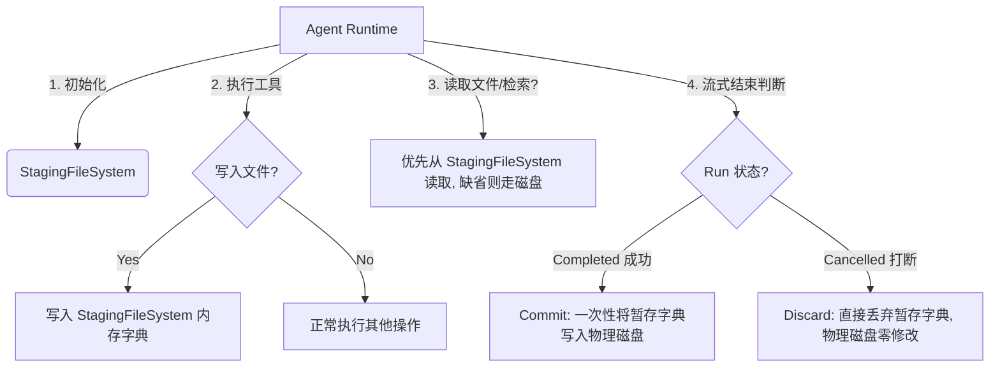

# TASK-092: 内存虚拟文件系统暂存与打断回滚机制 (In-Memory VFS Staging & Cancellation Rollback)

## 1. 目标与背景 (Goal & Background)
当智能体（Agent）在运行过程中被用户强行打断，或者在等待后台子任务完成期间被迫中止时，目前的系统存在两个严重的设计缺陷：
1. **多线程后台工具脏写 (Dirty Write)**：由于 Python 的 `ThreadPoolExecutor` 线程无法被外部强行终止，已被中止的 Run 所派生的文件修改工具依然会在后台运行至结束，直接在未来的新运行轮次中向物理磁盘写入“过时/脏”的数据。
2. **缺少文件回滚能力 (Lack of File Rollback)**：文件写入工具（如 `write_file`）直接在物理磁盘上修改文件。如果一个批次的工具只写入了部分文件即被中止，本地工作区将留下半成品的损坏文件。

**核心方案**：在运行时引入一个轻量级的“内存文件系统暂存区”（In-Memory VFS Staging Area）。所有写文件的工具先写入内存暂存区，正常完成时才一次性提交（Commit）到物理磁盘，而打断时直接丢弃暂存区（Discard/Rollback），确保物理磁盘的绝对安全和状态一致性。

---

## 2. 方案设计 (Detailed Design)



### 2.1 内存文件暂存区 (`StagingFileSystem`)
在运行时上下文（`ToolCallContext` 或 `AgentState`）中挂载一个暂存区字典：
```python
class StagingFileSystem:
    def __init__(self, workspace_path: str):
        self.workspace_path = workspace_path
        self.staged_writes: dict[str, str] = {}  # filepath -> content
        self.staged_deletes: set[str] = set()

    def write_text(self, filepath: str, content: str):
        self.staged_writes[filepath] = content
        self.staged_deletes.discard(filepath)

    def read_text(self, filepath: str) -> Optional[str]:
        if filepath in self.staged_deletes:
            return None
        return self.staged_writes.get(filepath)

    def commit_all(self):
        for filepath, content in self.staged_writes.items():
            # 物理写入磁盘
            p = Path(filepath)
            p.parent.mkdir(parents=True, exist_ok=True)
            p.write_text(content, encoding="utf-8")
        self.clear()

    def clear(self):
        self.staged_writes.clear()
        self.staged_deletes.clear()
```

### 2.2 物理写入工具拦截 (Intercepting File Write Tools)
* 修改 `fs_write.py` 的 `write_file`：
  - 判断 `context` 中是否挂载了 `StagingFileSystem`。
  - 如果存在，直接调用 `context.vfs.write_text(path, content)` 并返回 `"Staged write in memory"`。
  - 如果不存在（例如独立测试运行），直接写物理磁盘。
* 修改 `fs_read.py` 的 `view_file` 和 `fs_search.py` 的 `grep_search`：
  - 读取或检索文件时，优先检查 `context.vfs` 暂存区中是否存在该文件的最新版本。若存在，使用暂存区中的最新内容；若不存在，再读取磁盘。

### 2.3 提交与回滚生命周期管理 (Commit & Discard Lifecycle)
* **提交 (Commit)**：
  - 在 `RunPersistenceService.save_completed` 中，从最终的 `AgentOutput` 中获取 VFS 变更，并在数据库提交成功后，调用 `vfs.commit_all()` 物理落盘。
* **回滚 (Discard)**：
  - 在 `RunPersistenceService.save_cancelled` 中，直接清空或丢弃对应的暂存数据，不执行落盘，实现 100% 的打断安全手刹。
* **防脏写保障**：
  - 被取消 the Run 中未跑完的后台工具线程依然会继续写入。但由于它们持有的是**已被废弃的 cancelled 运行上下文的 VFS**，它们写入的也是即将被垃圾回收的内存字典，绝不会污染后续新 Run 已经在写物理磁盘的工作区。

---

## 3. 任务卡拆解 (Task Specification Template)

```text
用户动作：
1. 用户启动一轮耗时或并发工具写入任务（如让 Agent 写 5 个代码文件）。
2. 用户在生成完成前，点击打断或输入新消息排队触发自动打断。
3. 检查本地工作区文件，确保没有任何半成品文件写入。
4. 在下一轮对话中，如果任务成功跑完，文件被一次性落盘，文件内容完整一致。

用户会看到：
- 工具流式执行卡片显示 `[暂存] 写入文件 (write_file)` 状态。
- 如果发生打断，提示“写入已回滚，本地项目保持清洁”。
- 页面刷新后，已取消的工具调用卡片上会有“已丢弃 / 已回滚”的标签提示。

新数据从哪里产生 / 存在哪里：
- 暂存的内存文件变更由 `fs_write` 工具产生，暂存在 `ToolCallContext.vfs` 内存字典中。
- 最终落盘由 `RunPersistenceService` 提交控制。

前端调哪个接口 / need改的层：
- 后端：
  - `agent_prototype/tools/builtin/filesystem/fs_write.py` (写入拦截)
  - `agent_prototype/tools/builtin/filesystem/fs_read.py` (读取重定向)
  - `agent_prototype/execution/persistence/service.py` (提交生命周期)
  - `agent_prototype/execution/streaming/stream_run_session.py` (生命周期清理)
- 前端：
  - 修改 `ToolCard.vue` 识别暂存与回滚状态并渲染徽章。
```
