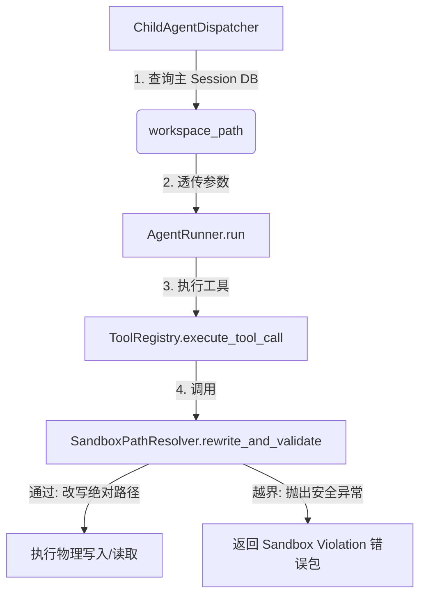

# TASK-093: 统一工作区投影与沙箱安全校验 (Unified Workspace Staging & Sandbox Path Redirection)

## 1. 目标与背景 (Goal & Background)
在此前的设计中，`SandboxMiddleware` 仅作为异步流式引擎（`async_stream_run`）的中间件生效。同步执行模式（`agent.run()`，如子 Agent 在线程池中的同步执行）完全绕过了沙箱拦截器，且创建子 Agent 任务时未传递 `workspace_path`。这直接导致了两个问题：
1. 子 Agent 的相对文件路径写盘工具（如 `write_file`）在相对路径定位时，以进程的 CWD（即本地开发根目录）为基准进行了写入，污染了开发项目。
2. 同步模式下存在路径越界逃逸的安全漏洞（无法拦截 `../` 等逃逸行为）。

**核心方案**：
1. **统一路径重定向层**：将 `SandboxMiddleware` 的路径解析与安全拦截逻辑抽离为无状态的公共服务 `SandboxPathResolver`。
2. **注册表层统一拦截**：在 `ToolRegistry.execute_tool_call` 的统一执行入口中，强制调用 `SandboxPathResolver`。无论同步还是异步模式，只要 context/session 关联了物理工作区，全部强制执行物理路径改写与越界安全校验。
3. **子代理参数补齐**：在子智能体调度器 `ChildAgentDispatcher` 中，自动从数据库查询主 Session 的 `workspace_path` 并透传给子 Agent 的运行输入中。

---

## 2. 方案设计 (Detailed Design)



### 2.1 子任务参数补齐 (`ChildAgentDispatcher`)
在 [child_agent_dispatcher.py L119](file:///Users/wangxu/Documents/AGENT%20Build/backend/execution/child_agent_dispatcher.py#L119) 中，根据 `session_id` 查询会话主记录，获取 `workspace_path`，并传入子 Agent 启动入参：
```python
# 查询主 Session 绑定的工作区路径
workspace_path = None
session_rec = db.query(SessionRecord).filter(SessionRecord.session_id == session_id).first()
if session_rec:
    workspace_path = session_rec.workspace_path

output = agent.run(
    AgentInput(
        session_id=session_id,
        user_input=task,
        workspace_path=workspace_path,  # 透传工作区物理绝对路径
    )
)
```

### 2.2 抽离 `SandboxPathResolver` 统一工具层
新建 `backend/security/sandbox/resolver.py`，实现同步的参数校验与重定向逻辑：
```python
class SandboxPathResolver:
    @staticmethod
    def resolve_and_rewrite(tool_name: str, arguments: str, workspace_path: str) -> tuple[bool, str, Optional[str]]:
        """解析并改写工具参数中的路径，同时校验越界。
        返回 (is_ok, modified_arguments, error_message)
        """
        # 实现与 SandboxMiddleware 完全相同的路径投影和父母路径验证逻辑
        ...
```

### 2.3 注册表执行器统一校验
在 [tools/registry.py L76 `execute_tool_call`](file:///Users/wangxu/Documents/AGENT%20Build/backend/tools/registry.py#L76) 中，调用 `SandboxPathResolver` 进行校验和改写：
```python
# 在 execute_tool_call 中：
workspace_path = getattr(context, "workspace_path", None)
if not workspace_path and hasattr(context, "extra"):
    workspace_path = context.extra.get("workspace_path")

if workspace_path:
    ok, arguments, err = SandboxPathResolver.resolve_and_rewrite(name, arguments, workspace_path)
    if not ok:
        return ToolResult(ok=False, error=ToolError(code="SANDBOX_VIOLATION", ...))
```

---

## 3. 任务卡拆解 (Task Specification Template)

```text
用户动作：
1. 用户在绑定了非本地项目目录（如 /Users/wangxu/Desktop/test）的会话中，委派子任务。
2. 子任务运行 `write_file(path="mars_colony_chapter3.txt")`。
3. 检查文件是否被写入至正确的 /Users/wangxu/Desktop/test/ 目录下，而不是本地开发项目目录。
4. 子任务如果尝试写入 `../` 越界路径，系统应当抛出 `SANDBOX_VIOLATION` 拒绝。

用户会看到：
- 子智能体的输出产物写入了正确的物理目录。
- 越界沙箱安全拦截依然坚固。

新数据从哪里产生 / 存在哪里：
- 通过 `ChildAgentDispatcher` 获取 `SessionRecord.workspace_path`。

前端调哪个接口 / need改的层：
- 后端：
  - `backend/execution/child_agent_dispatcher.py` (子任务参数透传)
  - `backend/security/sandbox/resolver.py` (新增通用解析层)
  - `backend/tools/registry.py` (注册表执行入口拦截)
  - `backend/execution/runtime/agent_runtime.py` (传递 workspace_path)
```
