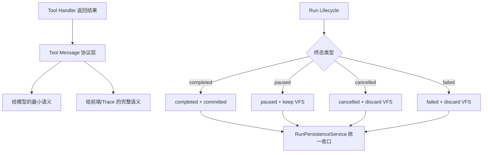

# TASK-094: 运行终态语义收口与低 Token 工具状态协议 (Run Finalization Semantics & Token-Efficient Tool State Protocol)

## 1. 目标与背景 (Goal & Background)
在 `TASK-092` / `TASK-093` 主线打通之后，当前系统已经具备：
1. run 级 VFS 暂存与取消回滚；
2. 工具上下文 VFS 注入；
3. 文件工具的 VFS-first 读写搜索主链。

但现阶段仍有一组**明确接受、暂不处理**的架构债与语义债：
1. **工具成功语义过粗**：`tool_result.ok=True` 现在同时承载“工具执行成功”和“最终文件已落盘成功”的误导风险。对写文件工具而言，模型看到的其实只是 `staged success`。
2. **token 成本偏高 / 文案偏散**：工具返回文本同时面向模型、trace、前端，当前返回格式仍是自然语言句子，后续上下文会被无效细节污染。
3. **运行终态收口不对称**：`_handle_completed()` 走 `RunPersistenceService.save_completed()`，而 `_handle_paused()` 走 `ToolRunObserver.handle_paused()`，职责边界不统一。
4. **失败语义复用 cancelled**：当前网络异常、流式异常、用户主动取消都最终落到 `save_cancelled()`，数据库层没有独立的 `failed / network_error` 表达。
5. **DB 与 VFS 不是原子事务**：当前 `save_completed()` 先 `db.commit()`，后 `vfs.commit_all()`。这保证了主线可跑，但不保证崩溃场景下的强一致性。

**核心目标**：在不破坏现有主链路的前提下，把“模型看到什么”“前端展示什么”“数据库如何定义终态”“VFS 最终何时 commit / discard”收口成清晰、低 token、可演进的统一协议。

---

## 2. 方案设计 (Detailed Design)



### 2.1 工具状态语义拆分 (Tool State Semantics Split)
需要把当前单一的“工具成功”拆成至少三层：
1. `staged`
   - 工具执行成功；
   - 结果只进入当前 run 的 VFS；
   - 可供同一 run 后续 `read/search` 使用；
   - **不等于**物理磁盘已落盘。
2. `committed`
   - run 完成；
   - VFS 已真正提交到磁盘；
   - 这是文件系统终态，不一定需要回喂模型。
3. `rolled_back`
   - run 取消 / 失败；
   - staged 文件已被丢弃；
   - 对用户和前端是重要状态，对模型通常无价值。

### 2.2 给模型的低 Token 协议 (Low-Token Model-Facing Protocol)
工具返回文本不再承担前端文案职责。建议：
1. 模型上下文只保留它继续推理必须知道的信息；
2. 用**固定短格式**代替自然语言句子；
3. 默认只让模型看到 `staged`，不默认把 `committed` 回写到消息历史。

示例：
```text
STAGED_WRITE src/a.py 128
STAGED_DELETE src/old.py
READ_FILE src/a.py 128
```

而不再使用：
```text
Staged 128 chars to /path/src/a.py (not yet committed)
```

### 2.3 给前端 / Trace 的完整协议 (Frontend / Trace-Facing Rich Semantics)
模型上下文压缩后，前端与 trace 需要完整语义字段：
```python
ToolResult(
    ok=True,
    content="STAGED_WRITE src/a.py 128",
    metadata={
        "state": "staged",
        "path": "src/a.py",
        "bytes": 128,
        "display_text": "已暂存，等待提交",
    },
)
```

后续 run 收口时，还应存在 run 级事件或状态，表达：
1. `committed`
2. `rolled_back`
3. `failed`

这些信息应主要进入：
1. run trace；
2. 前端状态卡片；
3. 审计与调试视图。

默认**不进入模型消息历史**。

### 2.4 运行终态统一收口 (Unified Run Finalization)
后续要考虑把当前终态收口统一到单一持久化入口，而不是：
1. `completed` 走 `RunPersistenceService.save_completed()`；
2. `paused` 走 `ToolRunObserver.handle_paused()`；
3. `cancelled` 走 `RunPersistenceService.save_cancelled()`；
4. 网络异常也复用 `cancelled`。

目标方向：
1. 明确 run 终态枚举：
   - `completed`
   - `paused`
   - `cancelled`
   - `failed`
2. 统一由持久化服务决定：
   - DB 状态写入
   - VFS keep / commit / discard
   - 前端可见终态事件

### 2.5 一致性升级方向 (Consistency Upgrade Path)
当前方案允许：
1. `db.commit()`
2. `vfs.commit_all()`

后续如需更强一致性，可考虑：
1. 增加 `finalizing` 中间态；
2. 或引入可恢复的 commit log；
3. 或把文件提交和状态变更做成更明确的两阶段收口协议。

本卡只负责把这条升级路径显式化，不要求当前立即落地。

---

## 3. 任务卡拆解 (Task Specification Template)

```text
用户动作：
1. 用户让 Agent 读取或修改文件。
2. Agent 在同一 run 内多次继续读/搜/改这些文件。
3. 用户可能让 run 正常结束、进入审批、主动取消，或遭遇网络异常。
4. 用户刷新页面或进入下一轮对话，查看系统对这次 run 的描述是否准确。

用户会看到：
- 工具卡片区分“已暂存 / 已提交 / 已回滚 / 失败”。
- 高风险写入工具在 run 未完成时，不再误导性显示“文件已写入成功”。
- 网络异常与用户取消在 UI 上具备不同终态语义（后续收口目标）。

新数据从哪里产生 / 存在哪里：
- 模型侧最小工具状态协议由工具 handler / ToolRegistry 产生，并写入消息历史。
- 丰富终态语义由持久化服务与 run trace 产生。
- run 最终文件状态由 VFS commit / discard 决定。

前端调哪个接口 / need改的层：
- 后端：
  - `backend/tools/builtin/filesystem/*.py` (工具返回协议压缩)
  - `backend/tools/result_types.py` (结果 metadata 语义增强)
  - `backend/execution/streaming/stream_run_session.py` (终态收口重整)
  - `backend/observation/tool_run_observer.py` (paused 语义重新归位)
  - `backend/execution/persistence/service.py` (统一终态与一致性升级)
- 前端：
  - `frontend/src/components/chat/ToolCard.vue`
  - `frontend/src/components/chat/ToolTree.vue`
  - `frontend/src/composables/workspace/*`
```

