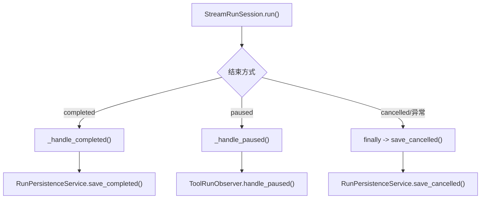
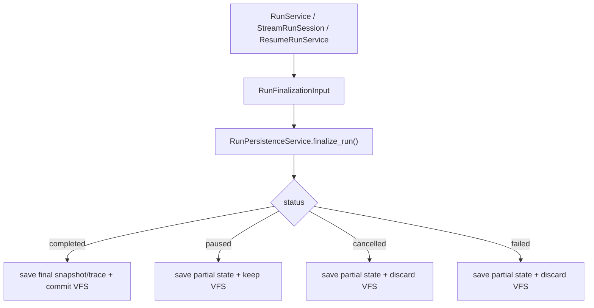

# TASK-094A: 统一 Run 终态收口重构教学卡 (Unified Run Finalization Refactor - Coaching Slice)

## 1. 这张卡为什么存在
`TASK-094` 已经明确了两个大方向：
1. 工具状态语义与低 token 协议
2. run 终态收口与生命周期架构整理

其中第二项属于**核心架构改动**，会同时影响：
1. `StreamRunSession`
2. `RunPersistenceService`
3. `ResumeRunService`
4. VFS 的 `commit / keep / discard`
5. `paused / completed / cancelled / failed` 的数据库表达

这类改动如果直接由助手一次性落地，虽然可以快速跑通，但风险在于：
1. 用户不一定真正理解“为什么要这样改”
2. 后续继续演进时，容易失去对终态边界的控制
3. 一旦出现回归，排障成本很高

因此这张卡的目标不是“让我替你写完”，而是：
**把终态统一收口这一层拆成可教学、可验证、可自己掌控的重构过程。**

---

## 2. 当前问题，必须先看懂

### 2.1 当前链路是分叉收口，不是统一终态状态机



### 2.2 当前结构的问题
1. `completed`、`paused`、`cancelled` 的收口入口不一致
2. `_handle_completed()` 和 `_handle_paused()` 不对称
3. `save_cancelled()` 语义过载，用户取消和系统失败容易混在一起
4. VFS `commit / keep / discard` 规则散落在不同方法中
5. 恢复运行 (`resume`) 又有另一套终态落库路径

---

## 3. 目标架构

目标不是“多加一个 helper”，而是把 run 的结束抽象成统一状态机：



### 3.1 目标边界
上游负责：
1. 判断 run 当前终态是什么
2. 组装统一的终态输入对象

下游负责：
1. 按终态写库
2. 按终态处理 VFS
3. 统一定义 run_status

### 3.2 目标收益
1. `StreamRunSession` 只负责“判定终态”，不负责“决定怎么写库”
2. `RunPersistenceService` 成为唯一 run 终态收口入口
3. `ToolRunObserver` 回到“工具副作用观察者”，不再兼任 run 终态落库
4. 后面做 `staged / committed / rolled_back / failed` 语义时，边界会更稳

---

## 4. 这张卡只做什么，不做什么

### 做什么
1. 建立统一终态枚举
2. 建立统一终态输入对象
3. 建立统一 `finalize_run()` 入口
4. 把流式主链与恢复链都切到统一终态入口

### 不做什么
1. 不优化 `tool_result.content` 文案
2. 不处理低 token 协议
3. 不处理前端 `staged / committed / rolled_back` 展示
4. 不处理 DB 与 VFS 的原子事务升级

---

## 5. 教学推进顺序
必须按层推进，不一次性倾倒所有文件。

### 第 1 层：类型层
目标：
1. 设计 `RunFinalStatus`
2. 设计 `RunFinalizationInput`

你必须看懂：
1. 哪些字段是 run 终态收口真正必需的
2. 为什么不能让 `finalize_run()` 继续吃零散参数

### 第 2 层：持久化入口层
目标：
1. 在 `RunPersistenceService` 建立统一 `finalize_run()`
2. 先内部桥接旧逻辑，再逐步收口

你必须看懂：
1. 为什么持久化层应该成为唯一 run 终态入口
2. 为什么 `paused` 也属于 run 的一种正式终态

### 第 3 层：流式主链层
目标：
1. `StreamRunSession` 只判断终态
2. 不再自己分别调 `save_completed / save_cancelled / handle_paused`

你必须看懂：
1. 为什么 `StreamRunSession` 不应该自己持有终态写库分叉

### 第 4 层：恢复链层
目标：
1. `ResumeRunService` 也切到统一终态入口

你必须看懂：
1. 为什么 `resume` 不能继续有自己的一套终态体系

---

## 6. 验收标准
重构完成后，应满足：
1. 同步 run 成功后，VFS 正常 commit
2. 流式 run 完成后，VFS 正常 commit
3. 审批暂停后，run_status = `paused`，VFS 保留
4. 用户取消后，run_status = `cancelled`，VFS discard
5. 系统异常后，run_status = `failed`，VFS discard
6. 恢复运行完成后，仍然走统一终态入口

---

## 7. 新任务拆解模板

```text
用户动作：
1. 用户发起一次普通 run、流式 run，或审批恢复 run。
2. 运行可能正常完成、暂停审批、被用户取消，或因异常失败。

用户会看到：
- run 的结束状态不再依赖不同代码分支的偶然实现，而是稳定对应 completed / paused / cancelled / failed。

新数据从哪里产生 / 存在哪里：
- 上游执行器产生 RunFinalizationInput
- RunPersistenceService 负责统一写库与处理 VFS

前端调哪个接口 / need改的层：
- 后端：
  - agent_prototype/execution/persistence/types.py
  - agent_prototype/execution/persistence/service.py
  - agent_prototype/execution/streaming/stream_run_session.py
  - agent_prototype/execution/resume/service.py
  - agent_prototype/observation/tool_run_observer.py
```
