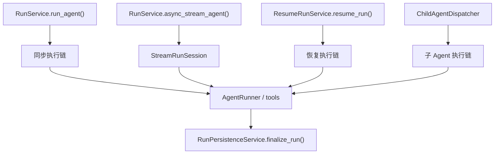
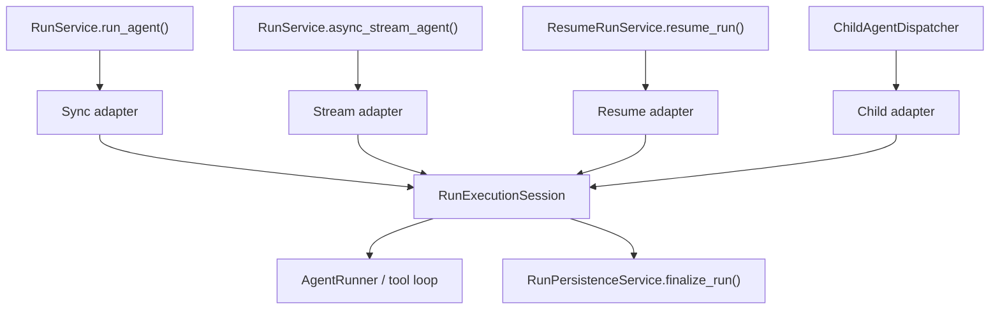

# TASK-094B: 统一 Run 执行生命周期层重构教学卡 (Unified Run Execution Session Refactor - Coaching Slice)

## 1. 这张卡为什么存在
`TASK-094A` 已经完成了一个关键收口：
1. 统一了 run 终态模型；
2. 统一了 `RunFinalizationInput`；
3. 统一了 `RunPersistenceService.finalize_run()`；
4. 让不同 run 入口最终都能收口到同一个终态状态机。

但目前系统仍然存在一个更深一层的结构问题：
1. `run`
2. `stream run`
3. `resume run`
4. `subagent run`

这四类执行型 run 虽然终态已经统一，但**执行生命周期本身**仍未统一。

当前尤其明显的问题是：
1. `StreamRunSession` 里混着两类职责：
   - 通用 run 生命周期职责；
   - SSE / streaming 协议职责。
2. `run`、`resume run`、`subagent run` 并没有复用同一个执行生命周期容器。
3. `manual /finalize` 虽然属于 run 相关入口，但它不是执行入口，而是收口入口，容易与前四类 run 混淆。

因此这张卡的目标不是继续改终态，而是：
**把“执行 run”这件事的共性，从 `StreamRunSession` 中抽离出来，形成一个通用的 RunExecutionSession 底层。**

---

## 2. 当前问题，必须先看懂

### 2.1 现在有四类执行型 run
当前最上层真正会驱动一次 Agent 执行生命周期的入口，可以看成四类：
1. `run`
2. `stream run`
3. `resume run`
4. `subagent run`

但它们目前并没有共用一个执行会话层。

### 2.2 当前链路结构



### 2.3 当前结构的问题
1. `StreamRunSession` 既做执行生命周期编排，又做 SSE 帧包装；
2. `run / resume / subagent` 各自保留了自己的执行壳层，没有统一复用；
3. 如果想让子 Agent 直接复用现在的 `stream run`，会把 SSE / delta / thinking 等前端协议语义一并带进去；
4. 这会让“执行层”和“展示协议层”继续耦合。

---

## 3. 目标架构

目标不是删除 `run`，也不是强迫所有入口直接走现在这版 `StreamRunSession`。

目标是把架构重组为两层：
1. **通用执行生命周期层**
2. **不同入口的薄适配壳层**



### 3.1 核心设计决策
1. `RunExecutionSession` 负责：
   - 通用 run 生命周期；
   - 事件收集；
   - 终态判定；
   - 构造 `RunFinalizationInput`；
   - 调 `RunPersistenceService.finalize_run()`。
2. `StreamRunSession` 只负责：
   - SSE frame 输出；
   - streaming 协议转换；
   - 把底层执行事件映射给前端。
3. `run / resume / subagent` 不删除，而是退化成各自的上层适配壳。

### 3.2 为什么不删除 `run`
1. 同步 `run` 对测试、脚本、内部调用更自然；
2. 它不需要 SSE 协议；
3. 它可以成为一个非常薄的 facade，但不应该直接消失。

### 3.3 为什么不让子 Agent 直接走现在的 `stream run`
因为当前 `StreamRunSession` 仍然带有：
1. `start / delta / end / paused`
2. `thinking_delta`
3. SSE 帧封装

这些属于前端交互协议，不属于子 Agent 执行的本质职责。

---

## 4. 这张卡只做什么，不做什么

### 做什么
1. 抽取通用 `RunExecutionSession`
2. 让 `run / stream run / resume run / subagent run` 复用同一个执行生命周期底层
3. 把 `StreamRunSession` 收窄成纯流式适配壳层

### 不做什么
1. 不继续改 `RunFinalizationInput` 语义
2. 不处理 `tool_result.content` 的低 token 协议
3. 不处理前端 `staged / committed / rolled_back` 展示
4. 不处理 DB / VFS 原子事务升级
5. 不删除 `manual /finalize`，因为它不是执行型 run

---

## 5. 教学推进顺序
必须按层推进，不一次性倾倒所有文件。

### 第 1 层：执行会话边界设计层
目标：
1. 明确 `RunExecutionSession` 负责什么 / 不负责什么；
2. 明确它的输入 / 输出；
3. 明确它与 `StreamRunSession` 的边界。

你必须看懂：
1. 为什么不能直接把 `StreamRunSession` 原样下沉；
2. 为什么真正该抽的是“通用执行生命周期层”。

### 第 2 层：执行会话类型层
目标：
1. 定义 `RunExecutionSession` 的依赖与返回结构；
2. 明确它需要的上下游协作者。

你必须看懂：
1. 哪些是通用执行必需物料；
2. 哪些是 streaming 特有物料，不能放进通用执行层。

### 第 3 层：通用执行主循环层
目标：
1. 把目前 `StreamRunSession` 里的共性主循环下沉到 `RunExecutionSession`；
2. 让它能同时服务同步、流式、resume 与子 Agent。

你必须看懂：
1. 事件收集、partial reply、终态判定这些逻辑为什么应当共享。

### 第 4 层：流式适配壳层
目标：
1. 让 `StreamRunSession` 只负责 SSE；
2. 不再自己持有执行生命周期主循环。

你必须看懂：
1. 为什么 stream 是协议层，不是生命周期层。

### 第 5 层：入口收敛层
目标：
1. `RunService.run_agent()` 改为复用 `RunExecutionSession`
2. `ResumeRunService.resume_run()` 改为复用 `RunExecutionSession`
3. `ChildAgentDispatcher` 改为复用 `RunExecutionSession`

你必须看懂：
1. 为什么这四类 run 的“共性”在这里，而不是在 HTTP 或 SSE 上。

---

## 6. 验收标准
重构完成后，应满足：
1. `run / stream run / resume run / subagent run` 共用一个通用执行生命周期底层；
2. `StreamRunSession` 只负责流式协议转换，不再持有核心执行主循环；
3. `RunExecutionSession` 不依赖 SSE 类型；
4. 同步、流式、恢复、子 Agent 的终态仍统一进入 `RunPersistenceService.finalize_run()`；
5. 现有 VFS commit / keep / discard 语义不被破坏；
6. 关键单测与集成测试全部通过。

---

## 7. 新任务拆解模板

```text
用户动作：
1. 用户发起普通 run、流式 run，或审批恢复 run。
2. 父 Agent 可能在运行中派生一个 subagent run。

用户会看到：
- 同步 run 仍然返回完整结果；
- 流式 run 仍然正常输出 start/delta/end/paused；
- 恢复 run 和子 Agent run 的行为不变，但后端结构更统一。

新数据从哪里产生 / 存在哪里：
- 通用执行事件、partial reply、终态判断由 RunExecutionSession 产生；
- RunPersistenceService 统一收口 DB 与 VFS；
- SSE 帧只在 StreamRunSession 这一层生成。

前端调哪个接口 / need改的层：
- 后端：
  - agent_prototype/execution/runtime/execution_session.py（新）
  - agent_prototype/execution/streaming/stream_run_session.py
  - agent_prototype/execution/service.py
  - agent_prototype/execution/resume/service.py
  - agent_prototype/execution/child_agent_dispatcher.py
```
